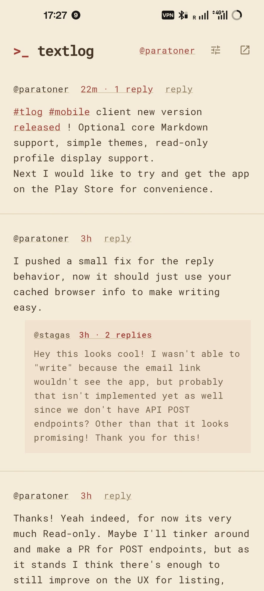
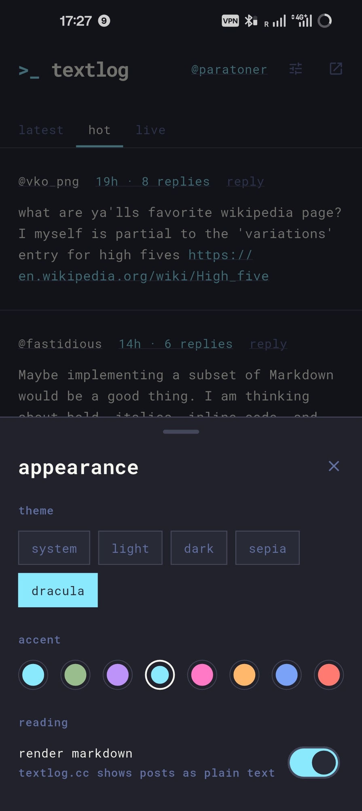

# textlog for Android & iOS

A community-built mobile client for [textlog.cc](https://textlog.cc) — a small, text-first
place to write short notes and follow people and hashtags you care about.

The website already works fine on a phone. This exists because a community deserves a way
in that feels like it belongs on the device: native scrolling, a live feed of new posts,
threads you can follow with your thumb, and posts that look exactly like they do on the
web. Nothing more. No algorithm, no metrics, no accounts of its own.

It follows the site closely and departs from it only where a phone asks for something
different — a flat thread view, a tap target a thumb can actually hit, a reading measure on a
wide window. Those departures are marked as such in the code.

<p>
  
  
  
</p>

---

[](https://f-droid.org/packages/dev.serge.textlog/)

**[Try it in a browser](https://faultless.github.io/textlog_flutter/)** — the same code as the
app, built for web on every push.

**Unofficial.** Not affiliated with textlog.cc — see [acknowledgements](#acknowledgements).

## Install

**Android — [F-Droid](https://f-droid.org/packages/dev.serge.textlog/)**, which is where this
should come from. Updates arrive with the rest of your apps, and F-Droid builds it from the
source in this repository rather than taking our word for it.

The build is [reproducible](fdroid/README.md): F-Droid rebuilds each release, checks it
against the APK attached here, and ships **ours** — same signature — so moving between the
two never asks you to uninstall.

If you would rather not install F-Droid, the same signed APKs are on
[Releases](../../releases). Take `textlog-<version>-arm64-v8a.apk` unless you know you need
otherwise; `textlog-<version>.apk` is the universal build, three times the size.

**macOS** — a `.dmg` on each release, ad-hoc signed rather than notarised. First launch: open
it, let macOS refuse, then **System Settings → Privacy & Security → Open Anyway**.

**iOS** — no downloads, and none coming while this is AGPL. You can build it for your own
phone in a few minutes — see [Building it for your own iPhone](#building-it-for-your-own-iphone).

## Roadmap

Read the whole thing in [ROADMAP.md](ROADMAP.md). In short:

**Working today (v0.8.0)**

- **Every feed the site has** — **@**, **my feed**, hot, new and all — plus a **live** tab
  the website cannot have, streaming posts as they are written. Server-side search across
  every note.
- **Threads** you can fold, with a **flat** view for when five levels of indent is four too
  many on a phone. Shallow levels arrive with the post; deeper branches load when you ask.
- **Posts render the way the site renders them** — code, **LaTeX**, tables, lists, rules,
  quotes, bold, italics, strikethrough, **redactions** you press to reveal, spoilers, and
  ASCII art on its own line grid. `#exec` output and **`#mermaid` diagrams** under the code
  that made them, `#map` places as a card, `#todo` checklists you tick, **polls** and
  **quizzes** you answer in place, link previews, and voice clips played where they sit.
- **An account, fully** — sign in by email code, then post, reply, edit, delete, follow,
  block, report, bookmark, keep drafts shared with the website, and edit your bio.
- **Notifications** for replies, mentions and follows, answerable from the notification
  itself. Feeds **mark themselves read as you scroll**, and a fresh start offers a dozen
  posts rather than a day's backlog.
- **Yours to arrange** — reorder or hide tabs, four themes, a choice of accent, monospace
  face and text size, and a **barebones mode** with characters instead of icons. Optional
  block markdown on top of what the site draws.
- **Opens where you left it**, already signed in, with the feed it had, before anything
  loads. Links back to textlog open in the app rather than the browser.

**Next**
- Share a post or profile through the system share sheet
- A `for you` unread jump, the way the site's "first unread" link works
- Instant notifications, which need an FCM or APNs endpoint textlog does not have yet

**Then — distribution**
- Automated builds attached to each release
- iOS, once there is a way to ship it that people can actually install

Android distribution is done: the app is **on F-Droid**, built reproducibly from this
repository. See [fdroid/README.md](fdroid/README.md) for what that took.

**Signing up stays in a browser on purpose**, because that is where the server puts its
abuse controls, and the API deliberately refuses to be a way around them.

## Development

Needs [Flutter](https://docs.flutter.dev/get-started/install) 3.41 or newer.

```sh
git clone https://github.com/Faultless/textlog_flutter.git
cd textlog_flutter
flutter pub get

flutter run                 # a connected phone or emulator
flutter run -d chrome       # in a browser

flutter test
flutter analyze
```

### Building it for your own iPhone

Needs a Mac with Xcode. A free Apple ID is enough — you don't need the paid developer
programme, but a free one signs the app for **7 days**, after which you re-run step 4.

1. Install the iOS platform SDK, once. It is several GB, and without it the build fails
   with "Unable to find a destination matching the provided destination specifier".

   ```sh
   xcodebuild -downloadPlatform iOS
   ```

2. Open the project in Xcode:

   ```sh
   flutter pub get
   open ios/Runner.xcworkspace
   ```

3. Select the **Runner** target → **Signing & Capabilities**. Choose your Apple ID under
   *Team*, and change the *Bundle Identifier* to something of your own, for example
   `com.yourname.textlog`. Apple will not sign `dev.serge.textlog` for you.

4. Plug the phone in and run it:

   ```sh
   flutter devices                  # find your phone's id
   flutter run --release -d <device-id>
   ```

5. The phone will refuse to open it the first time. Trust the certificate:
   **Settings → General → VPN & Device Management → your Apple ID → Trust**.

There are no prebuilt iOS downloads, and there won't be while this is AGPL — see
[Licence](#license).

## Contributing

Contributions are welcome, especially from people who actually use textlog. Issues,
suggestions and pull requests are all fine — and if you are unsure whether an idea fits,
open an issue first and let's talk about it.

Before a pull request:

- `flutter analyze` and `flutter test` both clean.
- Read [ARCHITECTURE.md](ARCHITECTURE.md). It is short, and it explains the two ideas the
  codebase leans on — pure logic in `core/`, and every feed being one `FeedSource`. New
  features are usually much smaller than they look once you know those.
- Match the surrounding style: immutable data, effects only in `data/`, and comments that
  explain *why* rather than restate the code.
- Keep the visual identity. Colours and spacing come from textlog's own stylesheet; if the
  site changes, change them here rather than inventing new values.

Please don't add tracking, analytics, ads, or anything that scrapes the site's HTML. The
first three are against the spirit of the place; the last one breaks the moment the server
changes its markup.

## Acknowledgements

textlog is designed, built and run by **[stagas](https://github.com/stagas)** —
[github.com/stagas/textlog](https://github.com/stagas/textlog). The service, its design,
and the public API that makes this client possible are all their work.

This app deliberately follows the site rather than reinterpreting it: the colours are its
CSS variables, the text is its monospace, and the way bodies render is a direct port of its
own code, so a post looks the same wherever you read it.

Thanks for building somewhere worth writing.

## License

[GNU AGPL v3](LICENSE) — the same license as textlog itself.

This is not an arbitrary choice. Parts of this client are ports of textlog's AGPL-licensed
source: the body tokenizer reproduces its `linkify`, the timestamps reproduce its `fmt`,
and the palette is its stylesheet's values. A translation into another language is still a
derivative work, so a permissive license was never ours to pick on our own.

The practical effect is the one we wanted anyway: anyone can use, study, change and share
this, and improvements stay available to the community. If you distribute a modified build,
share the source too.

One consequence worth knowing: AGPL and GPL apps have historically been incompatible with
Apple's App Store terms. Distributing on iOS would mean either relicensing — which needs
sign-off from stagas for the ported parts — or replacing those parts with independent
implementations.
